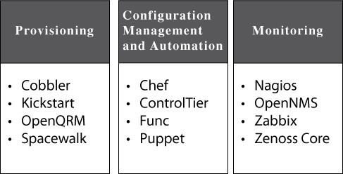

.. _linux_tool:

linux工具
#############

* 开源工具链: 一个程序的输出构成了另一个程序的录入,从而组成了一系列程序.比如说,使用 GNU Emacs编辑器,GNU bin-utils 和 GNU 编译器集
* DevOps 的工具链项目就是这些社区当中的一员
* 它们可以分为三大类:预备、配置管理和监控

* **预备类工具** 可以使 Linux 服务器上的软件安装包自动化.它们借助服务器上的软件包系统比如 rpm 或者 apt 来安装软件包,有些甚至会做一些粗略的配置工作

.. toctree::
   :maxdepth: 2

   tools/linux_tool_kickstart
   tools/linux_tool_cobbler
   tools/linux_tool_openqrm
   tools/linux_tool_spacewalk

* **配置管理和自动化** 是用来设置参数或者开启一个新服务器上的服务.它们也可以用来把系统还原到遇到错误之前的状态

.. toctree::
   :maxdepth: 2

   tools/linux_tool_chef
   tools/linux_tool_controltier
   tools/linux_tool_func
   tools/linux_tool_puppet

* **监控工具** 用来收集服务器数据,从而生成可用性、性能和其它系统状态的报告 

.. toctree::
   :maxdepth: 2

   tools/linux_tool_nagios
   tools/linux_tool_opennms
   tools/linux_tool_zabbix
   tools/linux_tool_zenosscore

