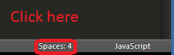

sublime使用
==================

把<tab>转为4个<space>:

::

   >> preferences->settings-user
   {
       "tab_size": 4,
       "translate_tabs_to_spaces": false
   }
           

把进行代码格式化(好像不是很好用的说)::

  >> Preferences → Key Bindings – User
  {"keys": ["super+shift+r"], "command": "reindent" , "args": {"single_line": false}}

