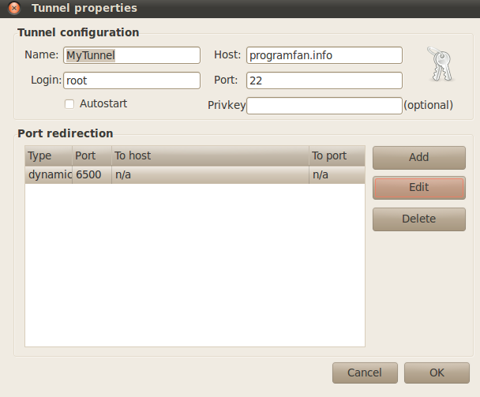
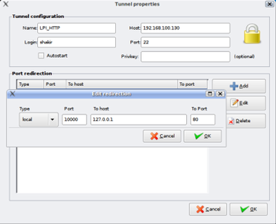
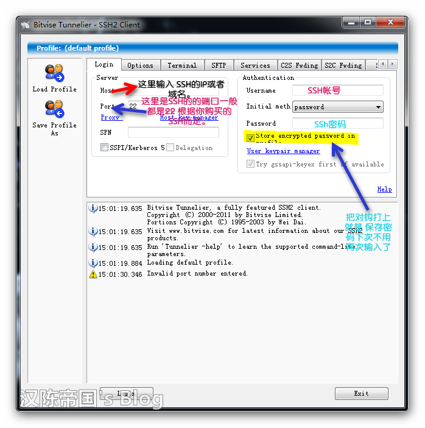
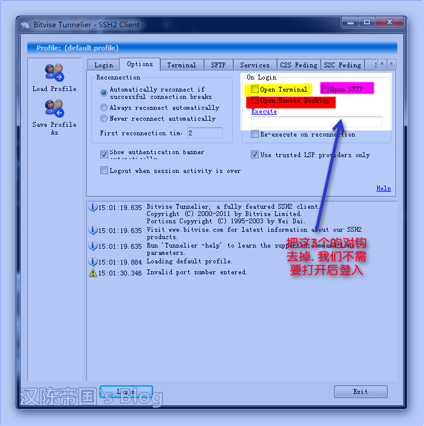
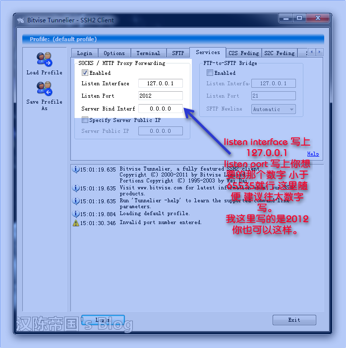
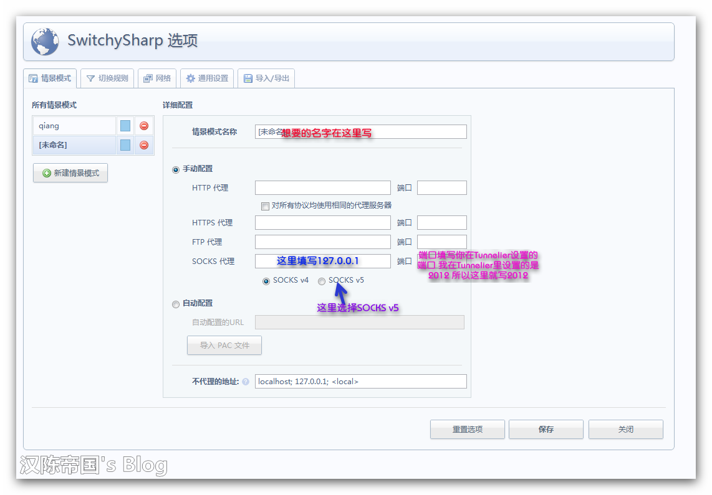
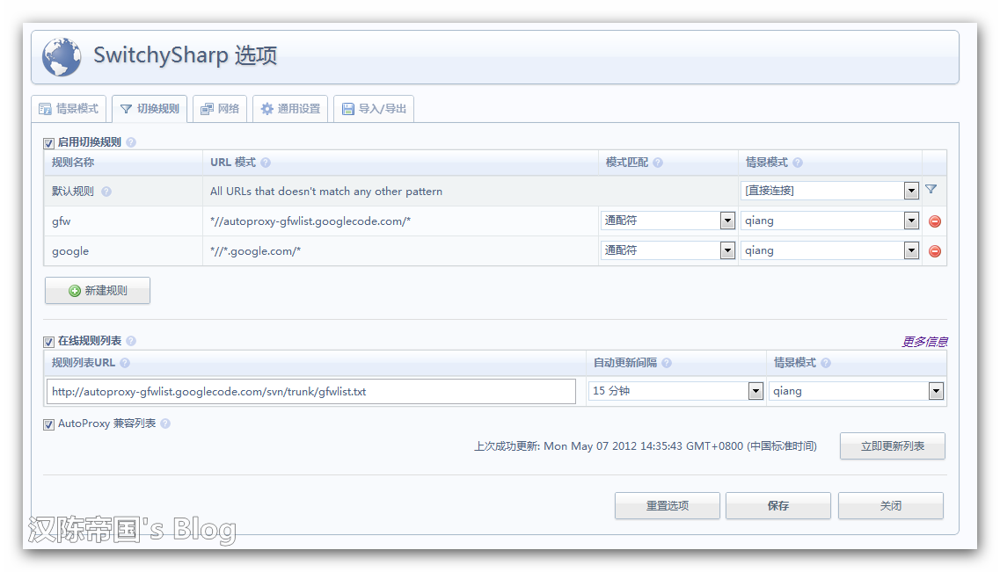
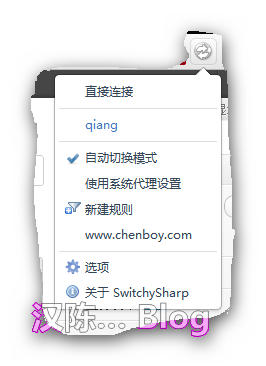
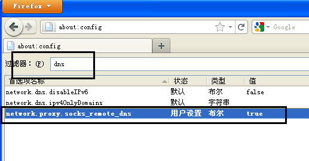

.. _technology_fanqiang:

翻墙技术
###################

ssh隧道
==================

启动ssh隧道
-----------------------

linux下操作
"""""""""""""""

* 直接使用终端,输入::

    ssh -D 7070 username@yourserver.com

    ssh -CfNg -D 0.0.0.0:1080 -l username xxx.xxx.xxx.xxx
    各参数含义:
    -C 传输时压缩数据
    -f 输入密码登陆后，ssh进入后台运行
    -N 不执行远程命令，只提供端口转发。仅用于ssh2协议
    -g 允许远程主机连接ssh转发端口
    -D 设置socks代理地址和监听端口，如果是只允许本地访问则指定IP为127.0.0.1
    -l ssh登陆用户名
    -i 指定ssh登陆用的私钥，如果是用公钥、私钥对登陆则需要指定
    // http://blog.csdn.net/luosiyong/article/details/7685273

* 使用gSTM客户端(ubuntu)::

    apt-get install gstm
    “应用程序->互联网“菜单下面找到:gSTM

* gSTM客户端使用:

windows下操作
"""""""""""""""
使用Tunnelier这个软件

* 首先打开软件后设置登入信息. 打开login选项, 然后看图:

* 打开Options选项 按图来就可以了 其他的不需要动:

* Options选择完后 接着打开Services选项:

开启浏览器代理
---------------------

普通设置(好像只适用于linux)
""""""""""""""""""""""""""""""""

* 注意是sockets v5代理
* 代理设置成 localhost <port>
* 需要是socket代理, 大部分支持sokcet代理
* 命令行程序用tsocket

Chrome浏览器使用SwitchySharp插件
""""""""""""""""""""""""""""""""""""""""""""

* 下载switchysharp插件
* 选择情景模式:

* 切换到规则选项, URL模式填写 ``*//autoproxy-gfwlist.googlecode.com/*``, 模式匹配选择 ``通配符``, 情景模式选择 ``我们刚才创建的情景模式``
* 选择下面的启用在线规则列表 打上对钩, 在规则列表URL 里写入 ``http://autoproxy-gfwlist.googlecode.com/svn/trunk/gfwlist.txt``, 在自动更新间隔 选择 ``30分钟`` 就可以了 你也可以随意选择, 最后的情景模式选择 ``你创建的那个``, 最后给AutoProxy 兼容列表 ``打上对勾``
* 保存 接着点立即更新列表来更新下列表.更新完后如果正常那么 就可以代理上网了
* 如图:

* 点击chrome浏览器的菜单那里的那个小图标:

FireFox浏览器使用SwitchySharp插件
""""""""""""""""""""""""""""""""""""
* 在Firefox地址栏输入  ``about:config``
* 点击 ``我保证会小心``, 在打开的窗口中的过滤器中输入 ``dns``, 找到 ``network.proxy.socks_remote_dns``, 双击使其值由false变为true

* 在Firefox输入网址: https://addons.mozilla.org/zh-CN/firefox/addon/autoproxy/ 然后打开(或在插件页面搜索autoproxy), 点击 ``添加到Firefox``
* 我有试过， 但总有问题，暂不试了

